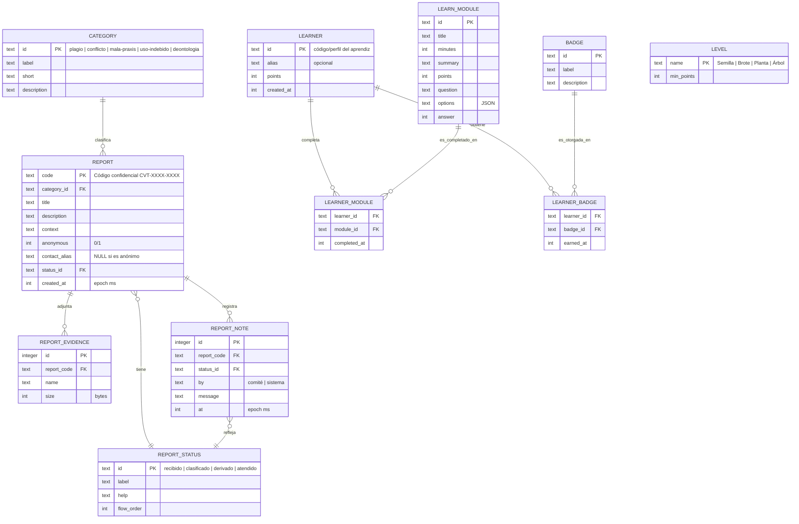

# Esquema de base de datos — CivicTech Ética (SQLite)

Modelo derivado del prototipo actual (`src/lib/types.ts` y `src/lib/store.ts`).
Sustituye la persistencia en `localStorage` por SQLite.

## Diagrama Entidad–Relación



## Notas de diseño

- **`REPORT.code`** es la clave natural (no se usa autoincrement) porque es el
  único identificador que conserva el reportante. Nunca se vincula a una
  identidad real: `contact_alias` solo existe si el reportante decide no ser
  anónimo.
- **`CATEGORY`, `REPORT_STATUS`, `LEARN_MODULE`, `BADGE`, `LEVEL`** son tablas de
  catálogo (datos de referencia). Hoy viven en `src/lib/constants.ts`; se
  pueden sembrar (seed) o dejarse en código y guardar solo los IDs como FK.
- **`LEARNER`** es nuevo: hoy el progreso formativo es único por navegador y sin
  identidad. Con BD se necesita un identificador de aprendiz (un código
  generado, igual que el del reporte) para separar el progreso de cada persona.
  `LEARNER_BADGE` materializa las insignias; las reglas de obtención siguen en
  código.
- Las insignias y niveles **se ganan por formación e integridad, nunca por
  número de reportes** — el esquema mantiene esa separación: no hay relación
  entre `LEARNER` y `REPORT`.
```sql
-- Ejemplo de definición de las tablas principales
CREATE TABLE report (
  code         TEXT PRIMARY KEY,
  category_id  TEXT NOT NULL REFERENCES category(id),
  title        TEXT NOT NULL,
  description  TEXT NOT NULL,
  context      TEXT NOT NULL,
  anonymous    INTEGER NOT NULL DEFAULT 1,
  contact_alias TEXT,
  status_id    TEXT NOT NULL REFERENCES report_status(id),
  created_at   INTEGER NOT NULL
);

CREATE TABLE report_evidence (
  id          INTEGER PRIMARY KEY AUTOINCREMENT,
  report_code TEXT NOT NULL REFERENCES report(code) ON DELETE CASCADE,
  name        TEXT NOT NULL,
  size        INTEGER NOT NULL
);

CREATE TABLE report_note (
  id          INTEGER PRIMARY KEY AUTOINCREMENT,
  report_code TEXT NOT NULL REFERENCES report(code) ON DELETE CASCADE,
  status_id   TEXT NOT NULL REFERENCES report_status(id),
  by          TEXT NOT NULL CHECK (by IN ('comité','sistema')),
  message     TEXT NOT NULL,
  at          INTEGER NOT NULL
);
```
